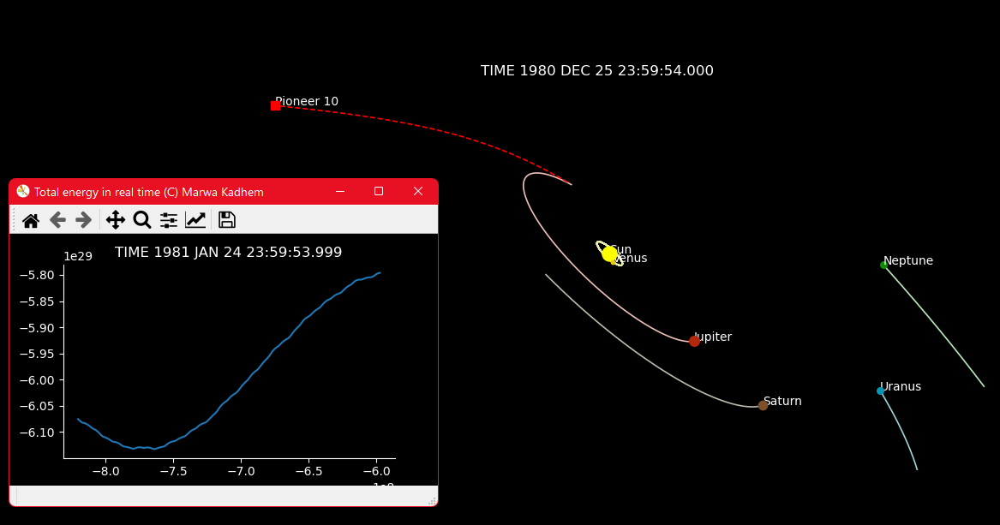

# Solar System 3D simulation


**General description**: 3D simulation of the Solar System by propagating the orbit of each celestial body, in addition to the interplanetary trajectory of Pioneer 10. The initial  conditions used to solve the n-body problem are generated using the ephemeris imported from the SPICE files (SpiceyPy library). 

Click here to see the [demonstration video](https://www.youtube.com/watch?v=g7ucAwWma2Y).

The program is structured in 3 files:
- **Module (PropagationModule.py)** which contains all the functions needed to solve the n-body problem applied on the Solar System. This includes getting the initial conditions from NASA SPICE (Spacecraft, Planet, Instrument, C-matrix, Events ephemeris) files through the spiceypy SPK kernel. 
- **Parameters (SimulationParameters.py)** PLEASE ENTER YOUR PARAMETERS HERE!
- **Main (SolarSystemSimulation.py)** which contains the main program including the animation of the plots using Matplotlib. PLEASE RUN THIS CODE!

## Prerequisites 
To run this code, a few packages are needed. If you are a beginner, I recommand to use Anaconda for easy package management.
### Installation of SpiceyPy
On Anaconda, you can use the following command: 
```
conda config --add channels conda-forge
conda install spiceypy
```
For more information check (https://spiceypy.readthedocs.io/en/main/installation.html).
### Downloading the DE440 planets data from SPK Kernel
Download starts automatically after clicking of this link: (https://naif.jpl.nasa.gov/pub/naif/generic_kernels/spk/planets/de440.bsp)


## Solving the N-body problem

The n-body problem is the problem of predicting the individual motions of a group of celestial objects interacting with each other gravitationally. In our case, we are solving an n-body problem restricted on the celestial bodies of the Solar System. 
The solve an n-body problem the following steps have to be implemented:
- Calculate the **acceleration** matrix using Newton's universal law of gravitation.
```
a_i = G * sum ( (r_j - r_i) / abs(r_j - r_i)^3 )
```
- **Integrate twice** the acceleration to obtain position of bodies. To do so, we used the Verlet-Störmer intergration, also known as the [leapfrog method](https://en.wikipedia.org/wiki/Leapfrog_integration). In addition to being very simple to implement, this integration provides very good results for space mechanics problems (good conservation of energy). The kick-drift-kick variant was here used in particular.
- Get initial positions from the SPICE ephemeris and the SPK kernel through the [SpiceyPy library](https://spiceypy.readthedocs.io/en/v2.3.1/documentation.html). Please read the package documention before. The needed binary data files are downloaded from the [NAIF website](https://naif.jpl.nasa.gov/naif/aboutspice.html). By initial conditions is meant the mass of the considered bodies, tbe initial velocities and the initial positions. 
- Calculate the **total energy** of the system to check energy conservation through time. This is a good way to validate our solution to the n-body problem.
- **Plotting** the results through time from the beginning of the simumation to the end with a given time step. Matplotlib and the [animation module](https://matplotlib.org/stable/api/animation_api.html) is used. 


## Keeping it simple

This code was written to be as understandable as possible for beginners in astronomical programming on Python 3. It is not the most optimized but it provides a good alternative to avoid using Object-Oriented Programming (OOP) for beginners. 




_Copyright (C) Marwa Kadhem_
